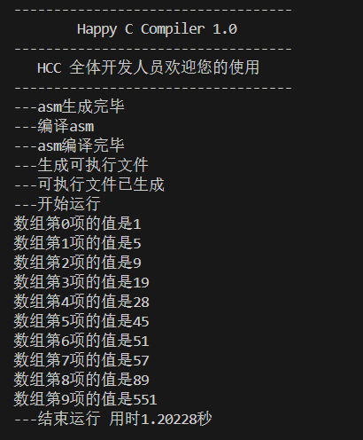
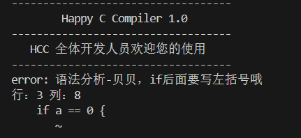

# Happy C Compiler 1.0

## 编译原理课程设计，一个功能丰富的，有趣的，类C语言简单编译器

## 本编译器支持：

- 使用递归下降子程序分析法
- 变量定义与赋值
- 条件语句
- `while` / `for` 循环
- `break` / `continue`
- 函数调用
- 数组
- 宏定义
- 结构化符号表、活动记录
- 四元式中间代码与优化
- 生成 NASM 汇编并链接成 Windows 可执行文件


## 运行方法

1. 安装nasm汇编器`https://www.nasm.us/pub/nasm/releasebuilds/2.15/win64/`，将安装路径（如`C:\Users\{YourUserName}\AppData\Local\bin\NASM`）设为环境变量

2. 在终端（使用命令提示符，不建议使用powershell，可能有未知问题）运行如下代码进行编译，注意：如果Compiler.exe正在运行，编译会报无权限错误。

```bash
g++ Compiler.cpp -std=c++17 -O0 -finput-charset=UTF-8 -fexec-charset=UTF-8 -o Compiler.exe

```

3. 执行
```bash
chcp 65001          # 切换到UTF-8编码
Compiler.exe        # 运行程序
```


## 更换测试样例

修改`Compiler.hpp`中如下内容以更换测试样例
```
#define FILE_NAME "test4.hcc"
```

## 常见问题

1. VS Code打开，中文显示乱码：编码更换为通过UTF-8打开
2. 执行时乱码：参照 运行方法 3
3. 编译Compiler.hpp失败：可能是之前运行的Compiler.exe未终止
4. 提示未找到nasm：请在安装nasm并配置好环境变量后重新打开VS Code
5. 输出显示不全或卡死：不建议使用VS Code C++插件编译，建议使用 运行方法 中的方式手动编译

## 运行示例

1. 示例一

代码：

```cpp

// 循环嵌套

int main() {
    int arr[10];
    // 设置数组初值
    arr[0] = 9; arr[1] = 28; arr[2] = 19; arr[3] = 57; arr[4] = 89;
    arr[5] = 5; arr[6] = 45; arr[7] = 51; arr[8] = 551; arr[9] = 1;
    int i; int j; int t; int p;
    int val1; int val2; int valt;
    i = 0;
    j = 0;
    while (i < 9) {
        j = 0;
        t = 9 - i;
        while (j < t) {
            val1 = arr[j];
            val2 = arr[j + 1];
            if (val1 > val2) {
                arr[j] = val2;
                arr[j + 1] = val1;
            }
            j = j + 1;
        }
        i = i + 1;
    }
    for (p = 0; p < 10; p = p + 1) {
        valt = arr[p];
        printf("数组第%d项的值是%d\n", p, valt);
    }
}

```
结果：




2. 示例二

代码：
```cpp
int main() {
    int a;
    if a == 0 {
        a = 1;
    }
}
```

结果：

